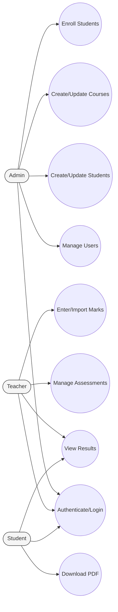

# Use Case Diagram

```mermaid
flowchart LR
  actorAdmin([Admin]):::actor
  actorTeacher([Teacher]):::actor
  actorStudent([Student]):::actor

  ucAuth((Authenticate/Login))
  ucManageUsers((Manage Users))
  ucManageStudents((Create/Update Students))
  ucManageCourses((Create/Update Courses))
  ucEnroll((Enroll Students))
  ucAssessments((Manage Assessments))
  ucMarks((Enter/Import Marks))
  ucResults((View Results))
  ucPDF((Download PDF))

  actorAdmin --> ucAuth
  actorTeacher --> ucAuth
  actorStudent --> ucAuth

  actorAdmin --> ucManageUsers
  actorAdmin --> ucManageStudents
  actorAdmin --> ucManageCourses
  actorAdmin --> ucEnroll

  actorTeacher --> ucAssessments
  actorTeacher --> ucMarks
  actorTeacher --> ucResults

  actorStudent --> ucResults
  actorStudent --> ucPDF

  classDef actor fill:#f5f5f5,stroke:#333,stroke-width:1px
```
